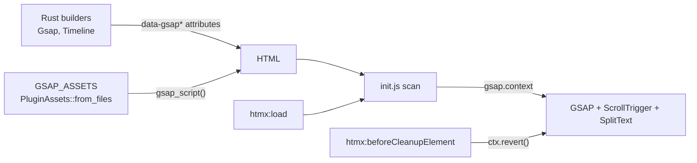

# ADR 0001: GSAP plugin design

- Status: accepted
- Date: 2026-10-08
- Applies to: autumn-plugin-gsap 0.1.0, autumn-web 0.8.0, GSAP 3.15.0

## Context

Autumn renders HTML on the server with Maud and htmx. Users want GSAP animations with no npm and no bundler.
The default Autumn CSP blocks inline scripts. htmx adds and removes content at runtime.
The prior art (`autumn-plugin-motion`) uses `data-*` attributes and one init script.

## Decisions

1. **Vendor three upstream files.** `gsap.min.js`, `ScrollTrigger.min.js`, `SplitText.min.js` (about 125 KB).
   We do not change the files. A test pins the `sha384` of each file. A CI job compares them with npm.
2. **Serve with `PluginAssets::from_files`.** The framework gives hashed URLs, SRI, ETag and immutable cache.
   The explicit file list keeps `manifest.json` private. The plugin does not force `embed-assets`.
3. **One attribute contract.** Rust builders write `data-gsap*` attributes. `assets/init.js` is the only reader.
   Attribute names follow GSAP names (`scrub`, `pin`, `start`, `toggle-actions`).
4. **Typed values.** `Duration` for times. Enums for eases, edges, actions and positions.
   `Props` accepts only listed property names. The builder does not write a value that is not finite.
5. **Lockstep tests.** A golden fixture (`tests/fixtures/attributes.json`) holds the Rust output.
   The JS tests parse each value with `init.js`. A Rust test checks that `init.js` uses the same regexes.
6. **One `gsap.context` per element.** `init.js` reverts it before an htmx swap, on
   `htmx:beforeCleanupElement`, and before htmx saves a history snapshot.
   This removes tweens, ScrollTriggers and SplitText of removed content, so nothing leaks.
7. **Timelines claim their children.** The scan does timelines first. A child of a timeline never animates alone.
8. **Fail soft.** A bad attribute value gets a console warning and the default. Missing GSAP means no animation.
   Reduced motion means no animation, unless the element has `data-gsap-reduced="animate"`.
9. **`Tag`, `id` and `class` on the wrapper.** The animated element can be the semantic element.
   SplitText then puts its `aria-label` on the heading, not on a generic `div`.
10. **Untrusted HTML.** `init.js` skips `data-gsap-ignore` and `hx-disable` regions.
    It pins only the element or an element in it.
11. **Two licenses.** The crate declares `Apache-2.0 AND LicenseRef-GSAP-Standard-License`.

## Consequences

- Users write no JavaScript for common animations. `window.gsap` stays available for custom code.
- A GSAP upgrade needs a plugin release (new files, new pins, new manifest).
- The license of the GSAP files is not Apache-2.0. The README and the manifest record the GSAP Standard License.
- Browser behavior has Playwright tests, so a GSAP upgrade that breaks the wiring fails CI.
